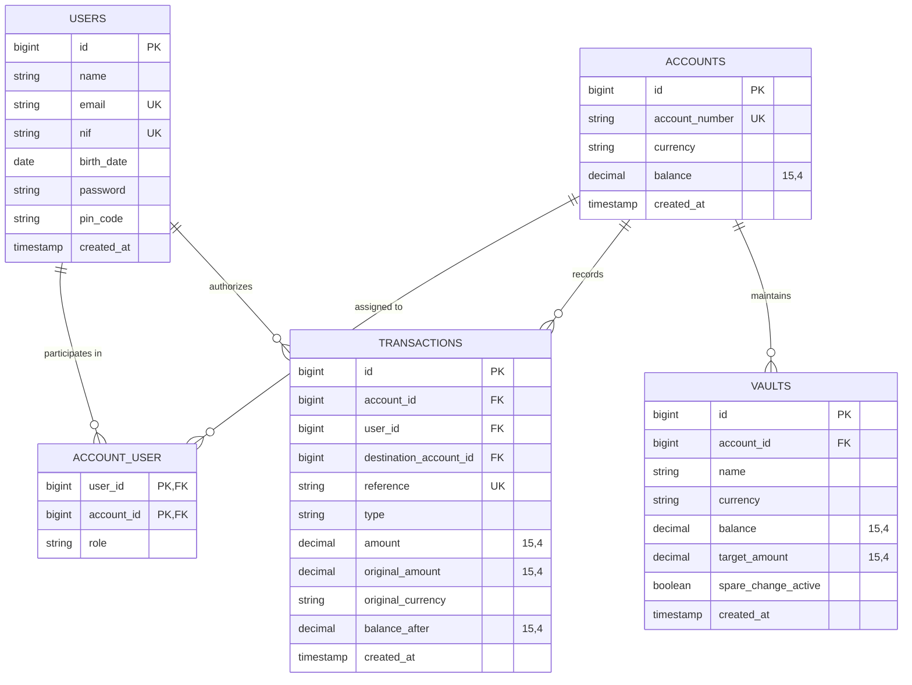

# 🏦 Core Banking API

<p align="center">
  
  
  
  
  
</p>

---

## 📌 Executive Summary

**Core Banking API** is a high-performance, enterprise-grade RESTful API simulating the transactional core of a modern digital bank (FinTech / Neobank). 

Engineered with a strong emphasis on **mathematical precision**, **ACID transactional resilience**, and **strict ledger auditability**, the system incorporates modern digital banking innovations inspired by platforms such as Revolut, Moey!, and Nubank — including real-time ECB foreign exchange, automated spare-change savings vaults, step-up 4-digit PIN authorization, and a dynamic French loan amortization simulator.

---

## 🏛️ Architectural Highlights & Core Capabilities

### 1. Mathematical Integrity with `DECIMAL(15,4)`
Standard floating-point types (`float`, `double`) introduce catastrophic binary approximation errors at the CPU level. To eliminate rounding drift, all account balances, vault savings, and ledger transactions are strictly processed and stored using **`DECIMAL(15,4)`**, guaranteeing exact monetary accounting to the fourth decimal place.

### 2. ACID Transactions & Pessimistic Concurrency Locking
All balance-mutating financial operations (Deposits, Withdrawals, Transfers, and Card Payments) run within atomic database transactions (`DB::transaction`) protected by **pessimistic row-level locking (`lockForUpdate()`)**.
* During cross-account transfers, accounts are retrieved and locked in deterministic sorted ID order to prevent database deadlocks.
* If any step fails (network outage, database error, or insufficient balance), an immediate rollback occurs, ensuring money never gets duplicated or lost in limbo.

### 3. "Step-Up" 4-Digit PIN Security 🔒
The application enforces a two-factor security model:
* **Session Layer:** Bearer token authentication powered by `Laravel Sanctum`.
* **High-Risk Operations Layer:** Critical money-out actions (`withdraw`, `transfer`, `payment`) require authorization through an encrypted **4-digit PIN** verified on-the-fly via `Hash::check()`.

### 4. Real-Time Multi-Currency FX Engine with Caching 💱
Supports multi-currency accounts and cross-currency transactions (EUR, USD, GBP, CHF, JPY, CAD, AUD).
* Integrates directly with the **Frankfurter API** (official European Central Bank reference data).
* Utilizes Laravel's Cache facade (`Cache::remember`) with a 3600-second (1-hour) TTL to prevent third-party rate limits and maintain sub-millisecond response latency.

### 5. Micro-Savings Vaults & Automated "Spare Change" 💰
* **Savings Vaults:** Sub-accounts tied to a primary checking account, with independent currency denomination and target savings goals.
* **Spare Change Rounding:** When executing a card payment (e.g. €4.20), the engine computes the mathematical ceiling (`ceil()`), debits the total (€5.00), and routes the spare change (€0.80) directly into the active savings vault within the same atomic transaction.

### 6. Cursor-Based High-Performance Pagination 📜
Instead of traditional `offset`-based pagination (which degrades exponentially ($O(N)$) as transaction tables scale into millions of rows), the ledger uses **cursor pagination (`cursorPaginate()`)**. This ensures constant $O(1)$ query execution time, ideal for mobile infinite-scrolling feeds.

### 7. French Loan Amortization Simulator (Price Table)
Features an analytical loan simulator computing exact monthly installments using the French constant-annuity formula:

$$P = V \frac{i(1+i)^n}{(1+i)^n - 1}$$

Generates a complete month-by-month schedule detailing principal amortization, interest charged on remaining capital, and declining balance down to zero.

---

## 🗂️ Database Architecture & Relational Model

The database is fully normalized and built upon **5 core entities**:



* **`users`:** Customer profile data including unique Tax ID (`nif`), date of birth, and hashed `pin_code`.
* **`accounts`:** Primary financial accounts with auto-generated unique `PT50` IBANs, balance (`DECIMAL(15,4)`), and base currency.
* **`account_user`:** Many-to-many pivot table defining ownership (`owner` / `member`), enabling future support for joint and corporate accounts.
* **`transactions`:** Immutable double-entry financial ledger recording unique reference IDs, original amounts, currencies, exchange conversion details, and post-transaction balances (`balance_after`).
* **`vaults`:** Dedicated sub-account savings buckets with automatic currency conversion and spare-change collection switches.

---

## 🗺️ API Endpoints Matrix

| HTTP Method | Endpoint | Description | Auth Level | Payload / Parameters |
| :--- | :--- | :--- | :--- | :--- |
| **POST** | `/api/register` | Register new customer profile and PIN | Public | `name`, `email`, `password`, `nif`, `birth_date`, `pin_code` |
| **POST** | `/api/login` | Authenticate customer & issue Bearer Token | Public | `email`, `password` |
| **GET** | `/api/accounts/my-accounts` | List all accounts associated with user | 🔐 Sanctum | None |
| **POST** | `/api/accounts` | Open account with PT50 IBAN and base currency | 🔐 Sanctum | `currency` (Optional, defaults to EUR) |
| **GET** | `/api/accounts/{id}/balance` | Query real-time account balance | 🔐 Sanctum | Account ID |
| **POST** | `/api/accounts/{id}/deposit` | Deposit funds with automated FX conversion | 🔐 Sanctum | `amount`, `currency` (Optional) |
| **POST** | `/api/accounts/{id}/withdraw` | Withdraw funds with PIN signature check | 🔐 Sanctum + PIN | `amount`, `currency` (Optional), `pin_code` |
| **POST** | `/api/transfers` | Cross-account transfer with FX and atomic locks | 🔐 Sanctum + PIN | `source_account_id`, `destination_account_id`, `amount`, `pin_code` |
| **POST** | `/api/accounts/{id}/payment` | Card payment with automated Spare Change rounding | 🔐 Sanctum + PIN | `amount`, `currency` (Optional), `pin_code` |
| **GET** | `/api/accounts/{id}/transactions` | Cursor-paginated ledger transaction history | 🔐 Sanctum | Account ID |
| **GET** | `/api/accounts/{id}/statement` | Filtered account statement with counterpart details | 🔐 Sanctum | `type`, `start_date`, `end_date` (Query params) |
| **GET** | `/api/vaults/my-vaults` | List all savings vaults across user accounts | 🔐 Sanctum | None |
| **POST** | `/api/accounts/{accountId}/vaults` | Create savings vault with custom currency and target | 🔐 Sanctum | `name`, `target_amount`, `currency` (Optional) |
| **POST** | `/api/vaults/{id}/deposit` | Fund vault from primary account balance | 🔐 Sanctum | `amount` |
| **POST** | `/api/vaults/{id}/withdraw` | Redeem funds from vault back to primary account | 🔐 Sanctum | `amount` |
| **PATCH** | `/api/vaults/{id}/spare-change` | Toggle automated Spare Change rounding on/off | 🔐 Sanctum | None |
| **POST** | `/api/loans/simulate` | Calculate French loan amortization schedule | 🔐 Sanctum | `amount`, `term_months`, `interest_rate`, `currency` |

---

## 🚀 Quick Start & Local Setup

Follow these steps to run the API locally in under 2 minutes:

### 1. Clone the Repository

```bash
git clone https://github.com/Afonsojlc/core-banking-api.git
cd core-banking-api
```

### 2. Install PHP Dependencies

```bash
composer install
```

### 3. Environment Configuration

```bash
cp .env.example .env
php artisan key:generate
```

*(By default, the application runs on SQLite with zero external database configuration required).*

### 4. Run Migrations & Seed Demo Data

```bash
php artisan migrate --seed
```

The database seeder automatically creates pre-configured accounts and demo profiles:
* **Demo User:** `demo@bank.com` | Password: `password123` | PIN: `1234`
  * Primary Account: `EUR` with balance of **€5,000.00**
  * Secondary Account: `USD` with balance of **$2,500.00**
  * Active Vault: `"Emergency Fund"` with Spare Change enabled (**€450.00**)
* **Transfer Counterpart:** `jane@bank.com` | Password: `password123` | PIN: `1234`

### 5. Start Development Server

```bash
php artisan serve
```

The API will be live at `http://127.0.0.1:8000/api`.

---

## 🧪 Automated Testing

The repository includes a comprehensive testing suite (`tests/Feature` and `tests/Unit`):

```bash
php artisan test
```

### Coverage Highlights:
* **`AuthTest`:** User registration validation (NIF, date of birth, PIN format), token issuance, invalid credential handling.
* **`AccountTest`:** PT50 IBAN generation, multi-currency support, balance access authorization (403 prevention).
* **`TransactionTest`:** Deposits, withdrawals with valid/invalid PINs, cross-account transfers with atomic rollbacks, card payments with automated spare change.
* **`VaultTest`:** Vault creation, funding, withdrawal, and spare-change toggle logic.
* **`LoanTest`:** Mathematical verification of Price constant-annuity amortization schedules.

---

## 📮 Postman Integration

Ready-to-run Postman collection and environment files are provided in the repository root:

* `Core_Banking_API.postman_collection.json`
* `Core_Banking_API.local_environment.json`

### Usage:
1. Open **Postman** and click **Import**.
2. Select both JSON files from the root directory.
3. Select the **Core Banking API - Local Environment** in the top-right environment selector.
4. Execute `1. Authentication -> Register New Customer` or `Login`. The automated test script will automatically capture the returned bearer token into the `{{token}}` environment variable, authenticating all subsequent requests.

---

## 🔮 Roadmap

- [ ] **Role-Based Access Control (RBAC):** Compliance and manager portal for account freeze and AML fraud monitoring.
- [ ] **Task Scheduling (Interest Accrual):** Scheduled cron jobs to credit micro-interest rates on savings vault balances.
- [ ] **Webhooks:** Push notifications dispatching real-time balance mutation events.

---

## 👨‍💻 Authors & Credits

This project was developed jointly by:
* **Afonso Carvalho** - [GitHub](https://github.com/Afonsojlc)
* **Rui Passos** - [GitHub](https://github.com/RuiPassos)

### 📄 License

This project is licensed under the [MIT License](LICENSE).
